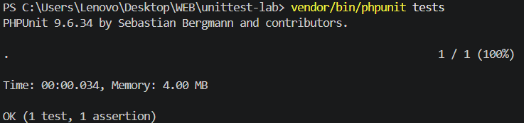
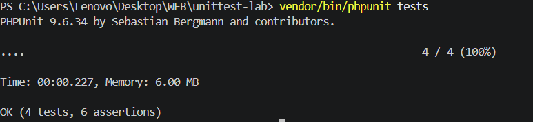
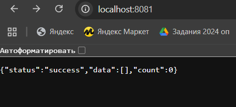
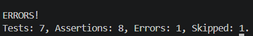

# Лабораторная работа №8: Тестирование PHP-приложения с использованием PHPUnit и Guzzle
устанавливать и использовать PHPUnit
писать unit-тесты для классов
использовать mock-объекты
тестировать HTTP-запросы через Guzzle
работать с переменными окружения (.env)
изолировать тестовую среду

## 💃 Автор
Меркулова Елизавета, ПМ-2

## 🌼 Вариант
10 

## 🍽️ Содержимое проекта

```www/ClickhouseExample.php``` — пример работы с Clickhouse

```tests/ApiTest.php``` – тест api

```tests/IntegrationTest.php``` – тест integration

```tests/StudentTest.php``` – тест student

```www/index.php``` — основная страница

```docker-compose.yml``` — описание Nginx

```nginx.conf``` — настройка Nginx

```screenshots/``` — скриншоты

## 📸 Скриншоты





## 🎉 Result
Super Puper PHP page with cookies, API and user info! caching has been implemented.
